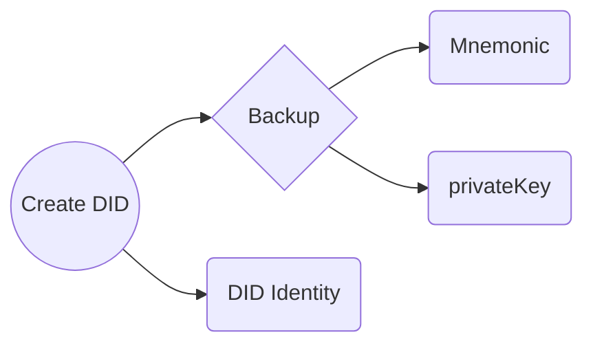
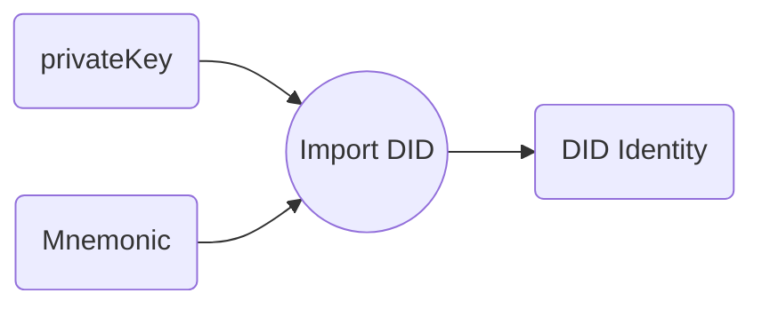

<h3 align="center">Decentralized Identity (DID)</h3>

## Why DID in Fula?
**DID provides trust, privacy and security in the Web 3.0 space.**

## What is Required?
Setting up decentralized identity with providers(blockchain/distributed ledger) usually consists of the following elements:

1. Identity owner: The user who creates their decentralized identity using the identity wallet.
2. Issuer/Verifier: An entity that issues and verifies identification information. They sign the transaction with their private key.
3. Blockchain/Distributed Ledger: A decentralized and distributed ledger that provides the mechanism and functions for DID and operation.
4. DID (Decentralized Identifier): A unique identifier that contains details such as public key, verification information, documents.

## Can we achieve creating DID without any providers?

**Of course yes, but with some flaws.** As long as we do not store all operations with DID on the ledgers, and unless all nodes verify it in the least, the security of the data will be lost. Moreover, data storage in blockchain/distributed ledger mechanism is immutable and permanent, and hence, modification and deletion are not possible. The decentralized identity systems use this mechanism so that no external entity can tamper or modify the data.

## How does it work?  

1. Create DID identity - 
With Create DID, we will have a DID identity and two secret keys options for backup.

2. Recover DID identity - We need a mnemonic or private key to restore identity.

[DID Implementation](https://github.com/functionland/fula/tree/fula-sec/libraries/fula-sec#decentralized-identity-did)
