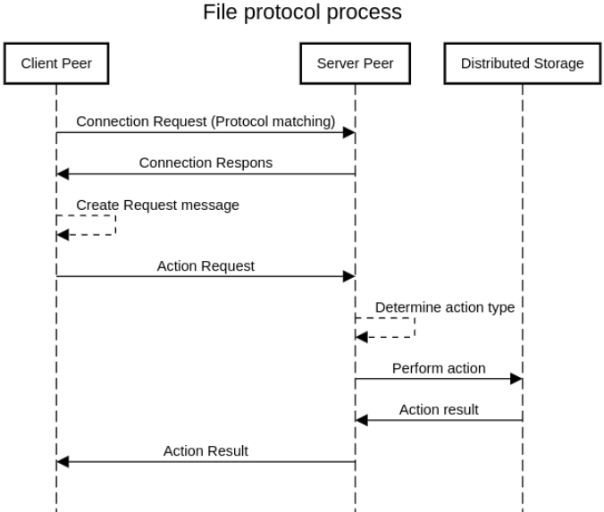

# File Protocol

This document provides a specification for the File Protocol. The goal is for the specification to be accurate and cover all the things needed for implementing the protocol in any environment using any programming language. Implementation details and trade-offs are out of scope for this document.

## Overview

The File protocol standardizes the process of file transfer between two peers in the Fula Network. More specifically, it facilitates file storing on the Fula network alongside retrieving and streaming them. Also, the File protocol allows each file to have metadata attached to it on the distributed file system.

In this specification, we cover the process of storing and retrieving files and also their metadata using File protocol. Note that we don’t cover implementation details about the storage layer here and have no assumption about the technology being used for it.

## Pseudo Client-Server model

The ultimate goal of the Fula Protocol Suite and specifically the File protocol is to provide a web2-like experience for DApp developers in the Fula network. Having that in mind, the File protocol should be able to abstract away all of the complexity of the decentralized storage while maintaining a web2 client-server interface.

Every request and response on the File protocol involves two peers, a client, and a server. These terms refer to the requesting and the responding ends of the connection.

The server peer is responsible for accessing the storage layer. On the other side, the client peer seeks access to decentralized storage through an intermediary peer.

With this definition, any peer with access to the decentralized storage can act as a server. In the Fula network, Box peers form a network providing decentralized storage. Other peers outside of this network, Edge peers, access this decentralized storage using an intermediary peer.

## Process

The overall process for a single communication to happen using the File protocol consists of multiple steps. The communication happens between two peers P1 (client peer) and P2 (server peer) on the Fula network.

1. P1 establishes a communication channel between itself and P2. This step may involve a preparation phase for protocol matching or any other application-specific requirement such as encryption.
2. P1 sends a Request object to P2 asking for an action.
3. P2 receives the Request object, checks for the action type that is requested, and passes the rest of the object to the corresponding action handler.
4. P2 gets the result from the action handler and sends it to P1 over the channel.

A complete end-to-end communication using the File protocol contains a single request. Each request can be for a particular type of action. The response for each request may differ based on the requesting action type.



## Schema

We define the schema for each message type using protobuf.

```protobuf
syntax = "proto3";

message Meta {
  string name = 1;
  string type = 2;
  uint64 size = 3 [jstype = JS_NUMBER];
  int64 lastModified = 4 [jstype = JS_NUMBER];
  optional bytes preview = 5;
}

message Chunk {
  string id = 1;
  optional uint64 skip = 2 [jstype = JS_NUMBER];
  optional uint64 limit = 3 [jstype = JS_NUMBER];
}

message Request {
  oneof type {
    string meta = 1;
    Chunk receive = 2;
    Meta send = 3;
  }
}

message File {
  Meta meta = 1;
  string contentPath = 2;
}
```

As you can see in the schema of the Request message, a request’s type can be one of meta, receive, or send. Based on request type, the schema for the request body is determined.

## Actions

Each action needs different arguments. These arguments are provided within the request's body.

A client peer can request these actions:

- **`send`:** request server to save a file on the distributed storage. When the request is of send type, the client must provide metadata for the file. The file's content is transmitted as a payload of the request message in bytes format. When the server receives a send request, it treats the request's body as the metadata and the request's payload as the file's content.
- **`receive`**: request server to retrieve a file from the distributed storage. To retrieve a file, the client must provide the identity of the file. The fields `skip` and `limit` are used for streaming chunks of a file.
- **`meta`**: request server to retrieve a file's metadata from the decentralized storage. In this case, all a client needs to provide is the identity of the file in string format.