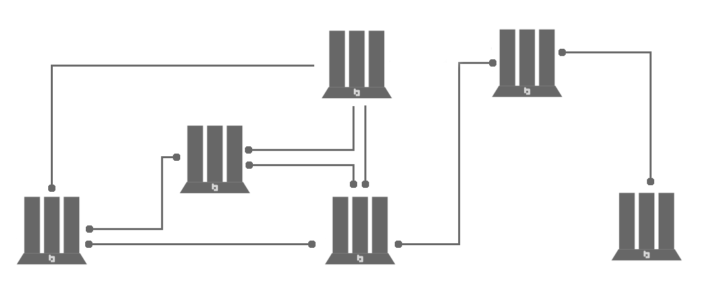
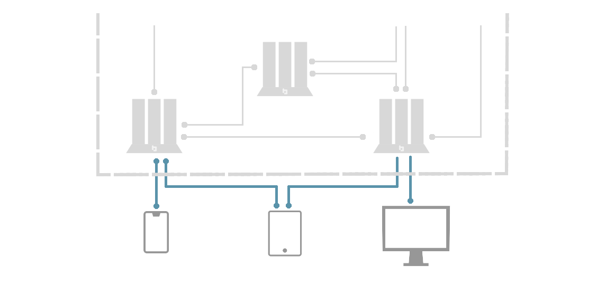
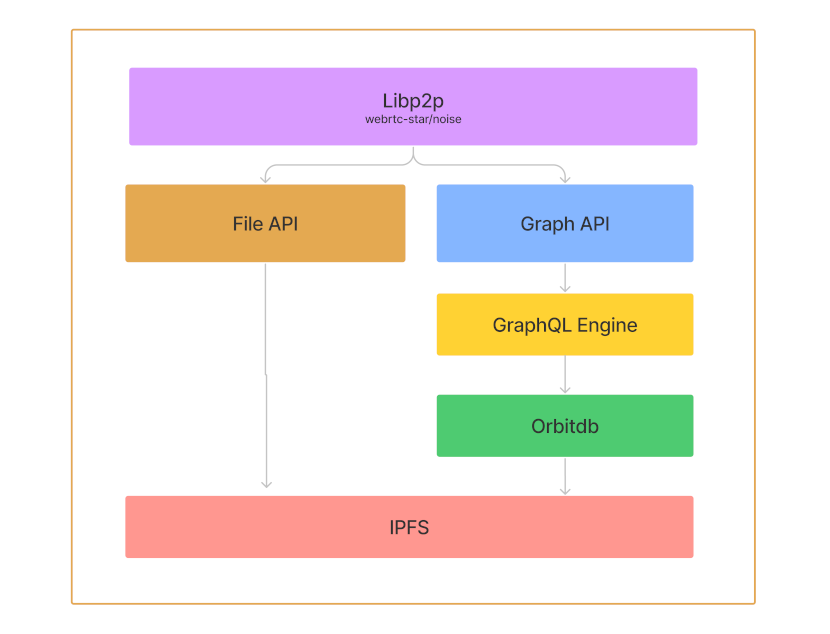
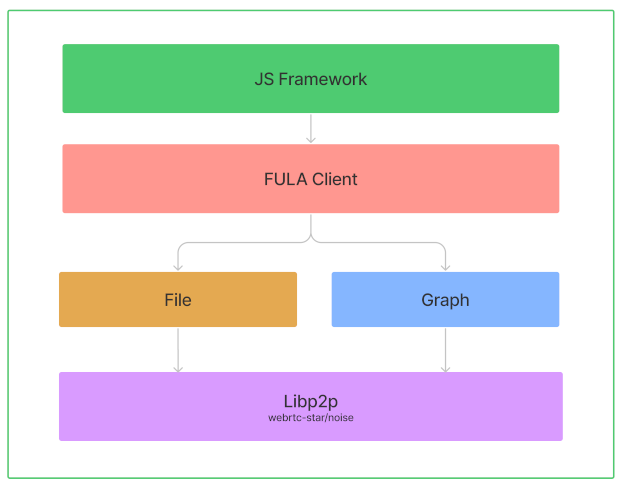

# Fula Network

The Fula network is a set of peers working together to provide an infrastructure for the realization of Web3 concepts. With this goal in mind, Fula is going to introduce all the necessary tools and standards for building a fully decentralized, future proof and interoperable version of the Web.

Since the world of Web3 is continuously evolving and new concepts and implementations are coming up every day, we focus on introducing standards and protocols which can be implemented with any programming language in any runtime environment. We started with Javascript to provide an implementation for the protocols, but we expect more implementations in different languages as the community around Fula grows.

In this section, we will explain the different components of the Fula network and illustrate how these components communicate with each other to provide users with a reliable Web3 experience.

## Architecture

The traditional way of creating a web application usually involves communication between a client and a server. In fact, whenever a web application client wants to use a resource, it must ask some server to provide that. This ‘Client-Server’ architecture enables web applications to access different kinds of resources stored on different servers.

In the Fula network, Box peers provide secure and reliable access to the data. The data is securely stored on an IPFS network. DApps running on Edge peers request data using protocols.

There are two types of peers:

- **Box peers:** form a p2p network storing a decentralized, secured, and replicated file system. Box peers also provide access to the data for peers outside of the p2p network. They support different protocols for requesting data of different types.
- **Edge peers:** run DApps (Decentralized Applications). They connect to a network of Box peers and request data using the appropriate protocol. Edge peers are just consumers of data, they may store some version of the data for local use but they don't participate in the data storing process.

To illustrate the topology of the Fula network, we divide the network into a Box-to-Box sub-network and a set of Edge connections:

- **Box-to-Box Network:** that includes only Box peers. This is a peer-to-peer connected network responsible for data storing. Each box can store its own data and participate in storing other Boxes’ data.

A network of Boxes - Each Box peer can be connected to one or more other Box peers

- **Edge Connections:** that enable DApps to request data from the Box network. You can think of these edge connections as the web3 equivalents for REST or other types of remote resource access methods.

Edge connections - Edge peers can connect to the Fula network using one or more Boxes

### Peers

Fula network comprises different types of peers. These peers collaborate to provide an infrastructure for DApps and other applications of Web3. By peer, we mean a computer device (desktop/phone/Box/…) that is connected to the Fula network and can request data or respond to others’ requests.

Currently, there are two types of peers in the Fula Network, Edge peers and Box peers. Each of these peers runs a different stack of libraries and supports a different set of protocols. In fact, we can identify peers based on what are they running and what protocols they support.

### Box Peers

Box Peers are the building blocks of the Fula network. You can purchase a Box from the market or simply run its software stack on any hardware you prefer.

Box peers form an IPFS network that stores the data using content addressing. Content addressing enables more efficient and tamper-proof solutions for storing the data.

On top of the decentralized file system, Box peers employ a layered architecture to provide different utilities for the Fula network users (DApps). Decentralized database, encryption, and replication are some of these utilities that you can expect from a Box peer in the Fula network.

Currently, a Box peer runs the following software stack:

- **IPFS**: On the lowest level, a Box peer uses IPFS for data storage. Box peers run a full node of IPFS (By a full node we mean an IPFS node with full API). Besides that, Box peers also run IPFS Cluster to handle private pools.
- **Libp2p**: Box peers use Libp2p for communication. Not only IPFS network (that runs on Box peers) uses libp2p for communication, but Box peers also use it for communication with other types of peers (Edge peers). Data exchange on the libp2p happens with the use of protocols. A Box peer may support multiple protocols that can be used by edge peers to access different forms of data.
- **OrbitDB**: Box peers should be able to store structured data (JSON documents) as well as unstructured data (files). OrbitDB is a database engine that uses IPFS as storage. It can be used to store different types of data and query them. Right now, we use OrbitDB to store JSON documents on the IPFS and query the data when needed.

Each Box peer has a Box daemon that runs and manages the above stack of tools. Box daemon is the runtime environment that enables all of these tools to work together at the same time.

Box Peer - software stack diagram

### Edge Peers

Edge peers are where DApps run. Different DApps run in different environments. By DApp we mean any application in any environment that relies on a decentralized network for access to data. With this definition, all a DApp needs to use the Fula network is a set of protocols. These protocols are used to communicate with the peers inside of the Fula network and request different utilities.

As said before, Edge peers can run in any environment. They can be written in any programming language. As long as they can communicate using supported protocols by the Fula network, they can benefit from all the utilities it provides.

To demonstrate the Fula networks’ capabilities and also help developers to start making their DApps, we have built `Fula-Client`, a javascript package that enables DApps to connect to a Fula network and benefit from the capabilities using the Fula protocols.

Edge peers are not a part of the Box-to-Box network so they don't participate in data storage. They are not part of the IPFS storage layer. Edge peers are thin lightweight clients that can communicate with a Fula network seeking storage and compute services.

Edge Peer - software stack diagram

[//]: # (## Protocols)

[//]: # ()
[//]: # (Fula Protocols define a standard way of communication inside the Fula network. There are different types of nodes in the network and also different types of needs for communication. For example, the File protocol defines a standard way for two nodes in the Fula network to transfer files.)

[//]: # (The two ends of communication can be of any type &#40;Box or Edge&#41;. The File protocol is an example of a protocol between a Box and an Edge peer. Other protocols may exist based on a certain need for communication for example joining into a Fula network can happen using a protocol between two Box peers.)

[//]: # ()
[//]: # (Currently, the Fula Protocol Suite has:)

[//]: # ()
[//]: # (- **File Protocol:** for storing files on Box peers in a Fula network. This protocol enables a peer to store a file on the network &#40;using IPFS&#41; or load a file from the network &#40;using CID&#41;. This protocol can be used between two Box peers or a Box and an Edge peer. Using File protocol you can fetch, stream, store and replicate files on a Fula network.)

[//]: # (- **Graph Protocol:** for storing and querying JSON structured documents in a Fula network. This protocol enables a peer to store JSON documents on the network and query them. The Graph protocol can be used to access a document-oriented database on the network &#40;IPFS&#41;. It is based on graphql and DApp developers can use it as a back-end service.)