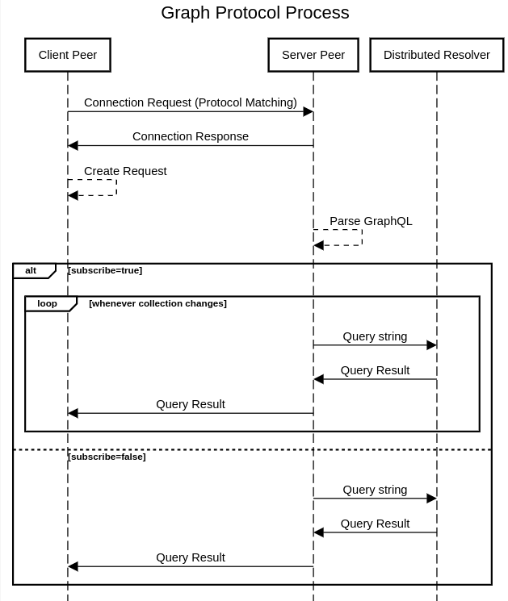

# Graph Protocol

This document provides a specification for the Graph Protocol. The goal is for the specification to be accurate and cover all the things needed for implementing the protocol in any environment using any programming language. Implementation details and trade-offs are out of scope for this document.

## Overview

The Graph protocol provides a standard language for performing CRUD (create, read, update, delete) operations on graphs over a distributed storage. Edge peers in the Fula network can request these operations to be performed on the distributed storage provided by Box peers.

The Graph protocol uses [GraphQL](https://graphql.org/) as the query language. In this version of the protocol, GraphQL is being used without any expected schema for the data. On the protocol level, we ensure that the query is in the right format using a GraphQL schema defining different possible operations (queries, mutations, ...).

In this specification, we cover the protocol parameters and also the query language for CRUD operations. Implementation choices for CRUD operations and schema validations are not in the scope of this document.

## Process

The overall process of a single CRUD operation using the Graph protocol between P1 (client peer) and P2 (server peer) con be shown below:

1. P1 establishes a communication channel between itself and P2. This step may involve a preparation phase for protocol matching or any other application-specific requirement such as multi-tenant support.
2. P1 sends a Request object to P2 asking for a CRUD operation.
3. P2 receives the Request object, parses the GraphQL query, and checks for schema validity.
4. Based on the `subscription` field in the Request object:
    1. If P1 is asking for a subscription, P2 enters the resolve loop:
        1. P2 passes the query to the corresponding resolver.
        2. P2 gets the result from the resolver and sends it to P1.
        3. P2 waits until the collection mentioned in the query changes or a termination signal arrives, then jumps to step [i] or [5] respectively.
    2. if P1 is **not** asking for a subscription:
        1. P2 passes the query to the corresponding resolver.
        2. P2 gets the result from the resolver and sends it to P1.
5. P2 terminates the connection.

Each round trip in the communication using the Graph protocol contains a request for a single CRUD operation on the distributed database and its result.



## Protocol Messages Schema

We define the schema for each message type using the Protobuf.

```protobuf
syntax = "proto3";

message Request {
  string query = 1;
  google.protobuf.Value variable_values = 2;
  string operation_name = 3;
  bool subscribe = 4;
}

message Result {
    oneof data_or_error{
        google.protobuf.Value data = 1;
        google.protobuf.Value error = 2;
    }
}
```

There are two message types. The `Request` message should have the following fields:

- **query**: The GraphQL query in string format. The `query` field must be aligned with GraphQL Schema (described later).
- **variable_values**: The values used for value injection in the query string. Following standard GraphQL definition, variables are defined using the `$` character in the query string. The `variable_values` object must have a key for each variable defined in the query.
- **operation_name**: The optional name for further referencing. The server peer returns the result of the operation together with the `operation_name`.
- **subscribe**: The flag indicating whether the client wants to subscribe to the query result changes or not. If this flag is set, the server peer keeps the connection open and sends the new result whenever the collection mentioned in the query changes.

The `Result` message type describes the result object that gets returned to the client peer. The Result message can either contain the data returned by the query resolver or an error that may have happened anywhere in the process.

## GraphQL Schema

The query string in the Graph protocol should be in GraphQL format. For full coverage of the CRUD operations and also the subscription feature, the server peer should implement all of the operations defined in the GraphQL schema.

```graphql
scalar JSON
input ReadInput {
    collection:String!
    filter:JSON
}
input CreateInput {
    collection:String!
    values:JSON!
}
input UpdateInput {
    collection:String!
    values:JSON!
}
input UpdateQueryInput {
    collection:String!
    value:JSON!,
    filter:JSON
}
input DeleteInput {
    collection:String!
    ids:[ID!]
}
type Query {
    read (input:ReadInput): [JSON]
}
type Mutation {
    create (input:CreateInput!):JSON!
    update (input:UpdateInput!):[JSON]
    updateQuery (input:UpdateQueryInput!):[JSON]
    delete (input:DeleteInput!):[ID!]
}
```