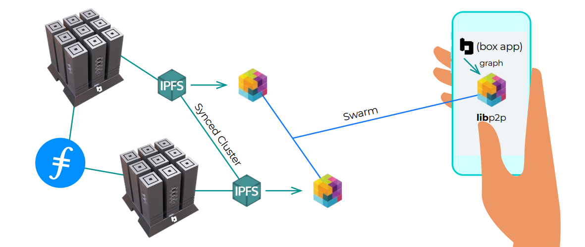

# Protocol Suite

The Fula Protocol Suite is a set of communication standards that enables DApps to benefit from all of the Web3 awesome features in the form of traditional client-server architecture. Protocols on the Protocol Suite standardize the process of requesting and accessing different utilities provided by the Fula network.

Most of the time, the protocols are used between an edge peer and a Box peer but they can also be used inside of the Fula network between two Box peers.

The Fula network uses libp2p as the communication infrastructure. Libp2p allows us to just focus on the data being communicated between different peers and its format. Although the definition of a protocol in the Fula Protocol Suite is independent of the infrastructure implementation, it is helpful to understand how a peer-to-peer network operates.

Currently, the Fula Protocol Suite consists of the following protocols:

[File Protocol](/concepts/file-protocol)

[Graph Protocol](/concepts/graph-protocol)