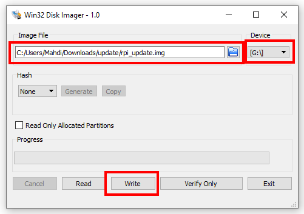

## Updadting Your FxBlox Lite (RPI)

### Step 1: Download the firmware

- **Download**: Find `rpi_update.zip` in the [latest release](https://github.com/functionland/rk1-image/releases/latest) under the Assets section on GitHub.

- Download: Download `Win32 Disk Imager` for writing update firmware to USB. 
https://win32diskimager.org/
  
### Step 2: Unzip and Write image to USB

1. **Unzipping**: Unzip `rpi_update.zip` on your computer. after unzipping there must be a .img  file.
2. **Writing Image to USB**:  
    - In Image File section select `rpi_update.img` file.
    - In Device section select USB Disk Partion letter.
    - click Write to start flashing USB Disk.

    

### Step 3: Updating FxBlox

1. **Turn Off**: Ensure your FxBlox (RPI) Lite is turned off.
2. **USB Connection**: Connect the USB drive to one of USB port of the FxBlox Lite (RPI).
3. **Power On**: Turn on your FxBlox Lite (RPI). after about 30 Sec The LED will blink yellow for 5 time that indicating the update process started.
4. in update process the LED blinks red and green. this phase is very critical, and any mistake in this phase cause breaking FxBlox Lite (RPI). 
5. **Final Steps**:
   - After about 10 minutes, the LED blinks red only. Remove the USB drive.
   - Restart the FxBlox lite (RPI) by unplugging and plugging back the power.

6. **Wait 10 min after First Boot**: On the first boot post-update, the FxBlox Lite (RPI) automatically reboots 3 times, taking about 10 minutes to fully process the update and show the FxBlox Lite (RPI) WiFi. Please wait for `10 minutes` before doing anything. You may think it is done or stuck or it is turned off, but be sure that it is processing hte update for `10 minutes` after the frist boot. We will add LED indicators in the future updates

### Step 4: Post-Update

- Future firmware updates will be automatic, eliminating the need for manual updates.

