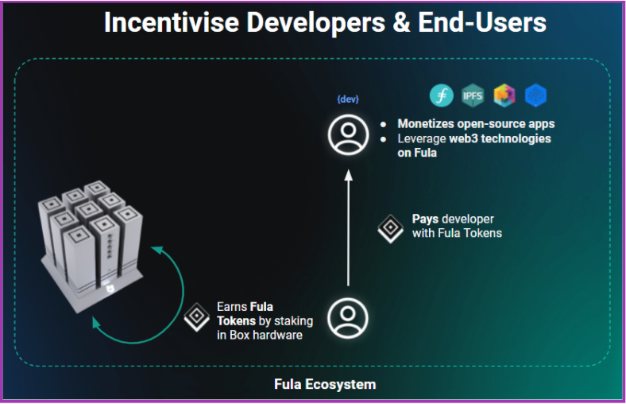
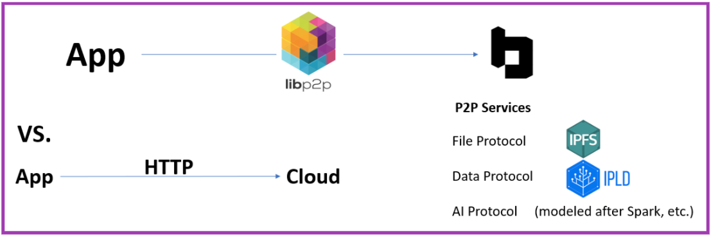

# Ending the Rental Web

A decentralized cloud alternative that solves the ‘paying problem' for users and open source developers

Version 0.2

February 2022

Functionland Team

## Abstract

Centralized cloud services offer powerful applications and seamless user experiences. But a provider’s incentives are often misaligned with users. In typical centralized cloud service models, users ‘rent’ the hardware for storage and computation and pay via a subscription, ads, or personal data.

As examples, if a cloud provider profits through user engagement (e.g., ad clicks), the rational behavior, given the incentive, is to draw attention and arouse reactions regardless of the users’ best interests.
A service may provide value to millions of users. But since cloud providers must generate profits for shareholders, they will likely shut down a popular service if it cannot demonstrate a viable revenue stream or tertiary strategic advantage.
Providers may offer ‘free’ services to attract users while planning to introduce a paid tier system later, knowing that a substantial proportion of users who become dependent on the service will be unwilling or unable to pay.

The Fula Network is a privacy-focused, user-owned, free-to-use open-source platform with a built-in incentive layer designed to reduce, eliminate or invert these misaligned incentives while giving the user total ownership of their data. 

## The Paying Problem

In the existing cloud service model, an entity provides the hardware infrastructure. That entity may own the infrastructure  (e.g., Google Drive) or rent it out (i.e., cloud services running on AWS, Filecoin, etc.). In either case, they provide the infrastructure as a service, and someone must pay.

Even if a cloud service developer wishes to provide a free service, they must pay the infrastructure cost (e.g., AWS) and must, in turn, recoup that cost from users. This prohibits any possibility for free-to-use, open-source alternative cloud services without reverting to monetizing the user’s data or attention. The paying problem will persist as long as developers and users must rent the computing and storage infrastructure.

### The Cloud’s Costs and Convenience

Centralized cloud services entered the mainstream in the mid-2000s, providing easy-to-use, cheap infrastructure. At that time, Microsoft’s web-based email Hotmail offered 4MB of storage per account. When Gmail entered the picture in 2004, it introduced an unheard-of 1GB of storage per account.

In 2000, hard drive storage cost around $10.00 for 1GB. As of 2022, storage has dropped to under $0.03 for 1GB. Computation has also seen a dramatic drop in cost; The equivalent computing power of an early 2000s PC is today matched by a single-board computer such as the Raspberry Pi. Costing as little as $35, it can run 24/7 with a fraction of the energy costs of its PC equivalent.

Cloud providers spare users the hardware costs and provide an unmatched user experience. In comparison, a user deploying their own hardware (e.g., a personal server such as NAS) requires a high level of technical expertise to install and significant time to set up and maintain, with software typically unintuitive and prone to issues. Lastly, a personal server does not provide data redundancy since it is confined to one server at one location.

## A decentralized platform built on user-owned hardware

We use low-cost, energy-efficient hardware to build a plug-and-play personal server with a simplified and intuitive user experience that can match the traditional cloud.  Finally, we use Web3 protocols to create a secure, encrypted network among a pool of devices, thereby attaining data availability and redundancy without requiring a single user to have more than one device.

### Utility

When the hardware that comprises the network is user-owned, we remove the need to rent from a third party. However, the network still creates value in the form of utility. Therefore, the hardware owners, i.e., the network users, are both utility providers and recipients of that utility.

On our user-run network, developers bear no infrastructural costs. Rather, they provide utility for which they are compensated based on usage.  In doing so, developers are incentivized to build free, open-source applications on the platform.

#### Fair Usage

The network’s utility depends on fair usage among all participants. We verify genuine resource-sharing and usage among users while maintaining privacy with zero knowledge using Proof of Resource. The utility provided and received can be measured and attributed a token value on a distributed ledger. This ensures sharing of resources among users, resulting in a net-zero transaction.

## Enabling Open-Source Development

Most open-source projects are not financially supported. Yet they form the foundation of the information economy. In most cases, they are created by individuals who must work a second job to support their open-source work. With a great deal of responsibility and stress placed on maintainers with little thanks and no compensation, burnout is widespread. As a result, even successful and widely used open-source software packages that provide value to millions are often abandoned by their core maintainers. This can, in turn, lead to issues with vulnerabilities and obsolescence.

The Fula Network’s incentive layer enables a monetization mechanism for open-source application development. Including compensation for any upstream dependencies in any project.

In addition to monetary support, we provide secure, open-source primitives that enable application developers to rapidly build peer-to-peer, open-source, decentralized applications using any programming language, such as JavaScript.

## The Fula Network
_Note: Sections will be subject to frequent additions and changes as we continue research._

By default, a user engages with the Fula Network as both a resource consumer (apps, storage, content, etc.) and a resource provider. A user can use services on the network without owning a connected device. However, interacting with the network this way will be costly since our primary goal is incentivizing a robust network composed of user-owned hardware.

### Layer designations on the Fula Network

*DIAGRAM 1a illustrates individual L3 Pool transactions rolled up to their respective L2 Chains. L2s then register to L1*

**Fula L1:** The Global Ledger of the FULA Token on Ethereum. FULA tokens can be bridged from Ethereum to any chain or rollup via a 1:1 mapping of ERC-20 tokens.

**Fula L2:** The Fula L2 is multichain and includes individual chains such as Polkadot, Cosmos, Algorand, and rollups such as Arbitrum, Polygon, etc. 

**Fula L3 PoolChain:** This uses Proof of Resources to verify all transactions on a given Pool. Transactions are rolled up and submitted to the Pool’s L2 to maintain an account of Fula tokens across all pools on a given L2.

### Defining the Network’s Key Elements
The **Fula Network** enables fair, secure sharing of resources among users. Users share resources to provide storage, content, and applications. The network comprises many smaller pools of users typically grouped based on geographical proximity.

A **Fula L3 Pool** is a local pool of computers that share resources. A user is free to choose to connect to any pool. However, by default, pools are suggested based on a user’s location to maximize data availability and response times.

A **Fula Node** describes any device connected to an L3 pool. Fula nodes are typically low-cost, energy-efficient devices such as a Raspberry Pi or Box. 

The **Fula Protocol Suite** consists of three sub-protocols: File, Graph, and AI. Each enables users to securely receive and provide resources on the Fula Network. In addition, each sub-protocol offers an abstraction layer that lets developers build applications using only front-end knowledge.

The **Incentive Layer** accounts for resources (e.g., apps and content) shared among users on the Fula Network using the Fula Protocol Suite. It consists of a verification layer and distributed ledger which quantifies utility transactions using Proof of Resource with zero knowledge. 
A user creates value by sharing resources on the network. A portion of this value automatically covers the user’s network usage by compensating other users who provided resources. Part also goes to developers and creators who provide utility in the form of apps or content.

**Proof-Of-Resource (PoR)** is a computationally efficient method to verify any sharing of computing power, storage, or data/content on the network with zero knowledge. This guarantees honest behavior among all network participants within an L3 Pool, with constant checks to ensure reliable uptime and availability for time bound resources. 

**The Fula Token (FULA)** is a utility token that functions as part of the incentive layer on the Fula Network. While initially minted as an Ethereum L1 ERC-20 token, any chain or rollup can become an L2 Chain for a Pool by bridging the Fula token.

### Fula L3 Pools
A pool is a network of devices (i.e. nodes) that connect to share resources.Each resource transaction within a pool is verified using Proof Of Resources (PoR). A batch of transactions is then rolled up and submitted to a Fula L2 Chain.

#### Data Availability on an L3 Pool
Typically, a pool is formed based on geographical proximity. This allows a user within the pool to share resources (storage, compute, data/content) with as few as 2-4 hops (i.e., user1 - isp1 - isp2 - user2). 
This enables server response times that can match and likely surpass that of centralized cloud services (i.e., user1 - isp1 - RegionalServer1 - CentralServer - RegionalServer2 - isp2 - user2). 

#### Mining
L3 Nodes mine tokens based on uptime and resources provided to peers.
Devices in a pool that are verified to be actively providing resources receive Fula L2 tokens which are released when an L3 validator issues a Proof of Storage certificate.

#### Parameters for Creating or Joining an L3 Pool
Any user can easily join an existing Fula L3 Pool or create a new one from the mobile app. A user may also manually join or set up a pool according to different parameters. For example:

- By geographical proximity  (i.e. by suburb, city, country, kilometer radius, etc.)
- Based on the L2 used.
- Based on the degree of data replication (i.e. 2x backups, 3x backups, etc.)
- A user may also create a private pool composed solely of their chosen contacts or their own devices.

### Fula L2
The Fula Network aims to be multichain. Various chains may function as a Fula L2 by bridging ERC-20 FULA tokens from Ethereum. A user who is creating a new L3 pool can choose their preferred chain to function as a given Pool’s Fula L2. Users joining an L3 Pool can also select a pool based on their preferred chain.

The L3 Fula Pool submits a sum of its resource transactions to its Fula L2 over a given period (e.g. 24 hours). The L2 ledger distributes tokens within a pool based on resources provided and used during that period.

### Fula L1
The FULA token genesis will occur on Ethereum. Ethereum acts as the global ledger for all FULA tokens in existence. FULA ERC-20 Tokens can be bridged from Ethereum to a smart contract on a Fula L2 chain.

## Blockchain
### Design Ideals
One of the criticisms of some blockchain technologies (e.g., Bitcoin) is that the security mechanism can work against its goal of decentralization; Miners benefit from economies of scale, which can lead to the centralization of infrastructure. For example, a PoW miner with access to free hydroelectric power has every reason to create as large a mining farm as possible. With Proof of Stake, centralization of infrastructure can occur out of convenience, as stakers choose to run their node on AWS or similar cloud infrastructure, which can weaken the network’s resilience against attacks.

The purpose of the Fula Network is to provide useful resource sharing among users. Therefore, the incentive mechanisms encourage a network founded on user-owned hardware. To achieve this, the incentive model reduces the benefit of staking a large number of FULA tokens on a single device. Running a server farm will be less advantageous than running individual nodes spread geographically.

Another criticism of Proof of Work is energy wastage. The energy in validating proofs presents no other utility. Almost the entire purpose of the Bitcoin network is to verify transactions for its token.

In the Fula Network, we utilize shared resources, such as computation and storage, to verify transactions. Since the verification is gained from that utility with no other energy expenditure required, it comes at a negligible energy cost.

### Proof of Resource
Proof of Resource (PoR) is a combination of two verification mechanisms: Proof of Utilized Storage and Proof of Compute.

In most blockchains, a node functions solely to secure the network. Therefore its energy, as in the case of PoW, or network activity, as in the case of PoS, is produced to secure the network. The primary function of a node on the Fula Network is to share useful resources such as storage and computation. We take these intrinsically-useful resources and utilize them for verification. This enables verification with a negligible additional energy cost which can be executed on energy-efficient devices.

### Proof of Utilized Storage
While storage has been used in other blockchains as a method for verification, the data stored is arbitrary, created solely to provide security. This drastically reduces the lifetime of storage media and expends energy with no other function served. 

Proof of Utilized Storage produces proofs from the storage, sharing, and usage of data on the network with zero knowledge. The data on the Fula Network is intrinsically useful.

The mechanism guarantees fairness, ensures that a chunk of data is replicated and available on the network, and helps maintain a ledger of storage shared and used at the incentive layer. 

#### Ensuring Data availability through Proof of Utilized Storage
A user may have one or more data backups on other devices in an L3 Pool. With automatic checks, even a single backup can provide a high level (99.99%) of data security.

**Verification flow**
- Devices that store a backup of another user’s data must frequently submit a proof of utilized storage (i.e., every N hours).
- If a device fails to submit a proof at the allotted time, the network identifies that a designated backup is unavailable. Token payments for the original backup are ceased and another candidate is found in the pool to back up that chunk of data.
- In the case where a user has a single backup, the user’s own data is used as the source for replication.
- The new party sends a proof and receives a token payment.

### Proof of Compute
Proof of Compute is primarily a distribution mechanism and secondly proof that the computation was correctly carried out. This is verified with mathematical proof or through replication. 

Proof of Compute is essentially a map-reduce compute job; For example, if a user wants to train an AI model to recognize a face on their private photos, they can distribute the job to 100 other Boxes devices where the computation itself can verify that computation was provided.

## Hardware
A primary aim of the Fula Network is to build a thriving network founded on user-owned hardware. Combined with our incentive layer, we can enable free-to-use utility, applications, and services to users while compensating developers and content creators.

We provide installers for different operating systems so that a user can set up almost any device as a node, even with install packages. However, even with this, setting up a personal server requires a much higher level of technical knowledge and time than most people are able or interested in. To maximize accessibility, we remove technical expertise and time as a barrier by introducing our plug-and-play hardware solution, Box.

### Box
Box is an open-source, plug-and-play node. It comprises a base that can accommodate up to nine individual modules called ‘Towers’. It is open-source and composable, using standardized dimensions with all I/O utilizing USB-C.  
It enables a composable, open-source hardware ecosystem available to any organization, project, or hobbyist, with a Plug and Play configuration that can securely interact with the Fula Network.

**Box Configurations**

Box’s default configuration includes the base with two active towers. One tower is dedicated to the CPU and storage, one functions as a hub, allowing users to connect additional devices such as an external storage drive. With these two functional towers on the base, Box has slots for up to seven additional plug-and-play towers. This provides a modular platform for open-source ARM hardware creators to access an existing network and user-base.

**Form Factor**

The Box consists of a base with nine slots. Each slot accommodates a tower, which has standardized dimensions. One slot is reserved for the standard hub tower. This leaves eight free slots for additional functionality (e.g., extra storage, GPU processing, etc.).

The modular design allows additional functionality and composability between towers. It comes with Linux and Fula installed. An app for iOS and Android will support Box to simplify the setup and maintenance, providing a connection wizard for home wireless as well as enabling OTA updates via Bluetooth.

Box will also function as one standalone tower, Box-Lite, which does not include storage, allowing users to use their 2 x USB-C Storage devices to store encrypted files and data on a Fula Pool. A storage expansion card such as the Frame.work 250GB or 1TB expansion can also work.

**Other devices on the network**

While low-power SBC devices minimize hardware and energy costs while providing enough power for most activities on the network, the Network aims to facilitate even more compute-heavy jobs such as AI. For example, for specific tasks, a gaming PC could provide more computing power than a cluster of 100 Boxes and will be compensated proportionally.

## Fula Protocol Suite
The Fula Protocol Suite is an abstraction layer that enables front-end developers to build dApps using their existing knowledge and within the client-server paradigm. For example, a developer familiar with front-end dev tools such as CoreJS and React Frameworks can immediately begin building Web3 apps using the Fula Protocols.

The Fula Network utilizes IPFS as its file system. We utilize private IPFS for all of a user’s private data. A separate IPFS instance is used for sharing, including full access management (e.g., contact permissions with revokable access), with the option to use public IPFS for high availability and easy sharing.

IPFS was created to form a mesh network among devices. However, running a mobile device as an IPFS node significantly impacts CPU, battery, and storage. We adapt IPFS to the Client-Server model. We repurpose Libp2p so that it replaces HTTP as the wire protocol, and we use the Fula Protocols to differentiate the client (e.g. a user’s mobile device, IOT device, Laptop, etc,) from the server (i.e., a dedicated L3 Node such as Box). This way, storage, CPU and energy requirements can be offset from the end user's mobile device and onto their dedicated Fula Node. This enables secure and efficient sharing of files, JSON data, and computation without any added load on the users’ mobile devices.

### File Protocol
The Fula Network does not store data on-chain. It utilizes IPFS, a distributed file system to enable users to have control over where their data is stored (i.e., in the Pool that they joined and nowhere else).

Transactions are free on IPFS. This creates a problem of incentives. For example, on IPFS, users have no implicit reason to keep data stored on the network. Fula’s File Protocol acts as a transaction layer on IPFS. It addresses the incentive problem by attributing value to data retention as a utility. Since users also provide the same service to others on the network, the transaction is essentially ‘free’ ( i.e., net-zero) for users.

### Graph Protocol
The Graph Protocol enables developers familiar with Rest APIs to access their data through GraphQL queries. This facilitates easier migration and implementation without the need to define schemas.

### AI Protocol
The same technologies that power Web2 data centers can be distributed and democratized to give everybody access to the technology. The Fula Network enables distributed MapReduce on consumer-grade hardware. This enables a graph of computation with a backdrop mechanism that enables AI, Language models, GPT3, etc. This is the same technology used by some distributed Data Unions. 

## BAS (Blockchain Attached Storage)
The Fula Protocol Suite addresses the fundamental limitations of NAS (Networked Attached Storage) by enabling plug and play home servers with NAT hole-punching. 

NAS (Network Attached Storage) requires a high level of knowledge and time to set up and manage. Backups are local and providing further replication must be set up manually. While there are plug-and-play NAS servers, users must access their files through a proprietary, centralized gateway. Since the data passes through a centralized relay, it sacrifices privacy, which is arguably the most significant advantage of NAS over centralized cloud providers.

Using the Fula Protocol Suite to network personal servers, a user can securely and privately back up their data at multiple locations without any additional setup. With high data availability and geographical distribution, backups are exponentially more secure than a manual backup solution. And with an open-source architecture, we enable a new platform on which to build free-to-use, privacy-focused applications. 

## Tokenomics
The Fula Network’s tokenomics will require ongoing research and testing. There are many unknowns and variables that will need to be experimented with to find the optimal solution. This section will be updated accordingly. 

The Fula Network effectively serves as a decentralized content distribution channel that can include all digital content, from mobile applications, apps, services, etc.  Pairing storage with computation enables the processing and customization of served content. And by replacing a centralized distributor with a user-owned decentralized platform, rewards can simultaneously compensate users for sharing the content, as well as developers and content creators who produced it.

Many consumers will always choose convenience and cost over all other considerations. For example, the free, peer-to-peer file-sharing protocol BitTorrent, which has persisted for over two decades and maintained a position as a “competitor” of Web2 content streaming services (e.g., Netflix, Hulu, etc.) despite sustained efforts to shut down and seize its centralized distribution channels (e.g., Piratebay).

However, as a distribution channel, the primary economic critique with BitTorrent is that it fails to reward content creators. And as a distributed network, its main failing is that it lacks an incentive model to encourage nodes to share (seed) content; Node operators have nothing to gain from sharing and, in many instances, may incur legal penalties for doing so. As a result, obscure data or files can get lost as users cease sharing the file from their device. The result is a heavy imbalance between content providers (seeders) and users (leechers).

The FULA Token, coupled with Proof of Resources, operates as an incentive layer that empowers sustained, long-term sharing of resources (content, applications, and computation) on the network. Finding the optimal approach will require ongoing research to ensure that users are incentivized to contribute as well as consume. And to ensure that app developers and content creators are compensated for the value they provide. 

Staking rewards will be dependent on hardware distribution. Using Proof of Resources, only nodes providing utility will gain rewards. A user’s device will have a smart contract wallet linked to its MAC address. This, in turn, is connected to a user-specific identity.  Earned FULA Tokens are staked at this address, and only the staking rewards (which are less for very large token-holders), are transferable to an external address.

### Utility-based Token Transactions
There will be more than one token flow on the Fula Network. Here is how we currently envision the utility-based token transaction:
- A user downloads and uses an app on the Fula Network.
- That users’ resource usage is measured (PoR) and given a value (1 FULA).
- A percentage of that 1 FULA is paid to the users who provided the resources received (i.e., app data). E.g., 70%
- The remaining 30% is paid to the app’s developer and the app’s software dependencies. This will be distributed among packages hierarchically.
- For example, 70% (0.21 FULA) could go to the app author.
- The remaining 30% (0.9 FULA) goes to the app’s next level of dependencies.
- If a package has its own dependencies, these too will be rewarded at a similar 70/30 ratio from the 0.9 FULA amount.

In the case of a Github-based project, compensation ‘airdrops’ can be claimed by committing a configuration to the project.

## Further Research
The current version of the Fula Network whitepaper is the result of collaboration among the Functionland team. As we continue our research we will update sections with more detail on the design. 

Our design is influenced by our core beliefs; We believe in a future that replaces ‘don't be evil’ with ‘impossible to be evil’.  A decentralized network composed of user-owned devices is a clear solution to the ‘paying problem’. We remove the need to rent from a third party. And instead, align incentives among the users, who are the network-owners, and utility providers, i.e., open-source developers and contributors. In this way, we can enable the benefits of centralized cloud services but without the inherent ‘evils’ that come from a model that relies on capturing a user’s private data or attention. 

As we progress, we will seek the best path to finally compensate open-source contributors for the value they bring forth to the world. We also consider how we can eliminate the major factors that, in recent years, as algorithms have become more sophisticated, adversely impact mental health among individuals and discourse within our communities. 